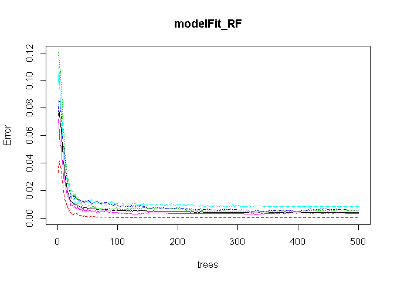
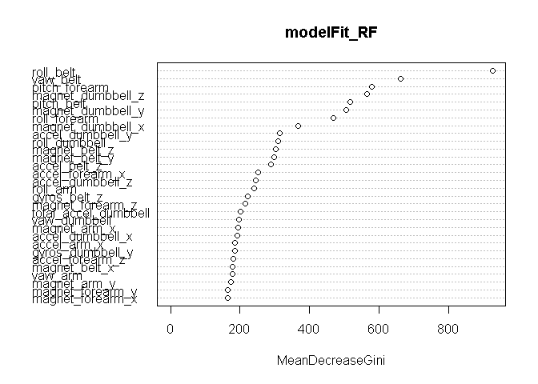
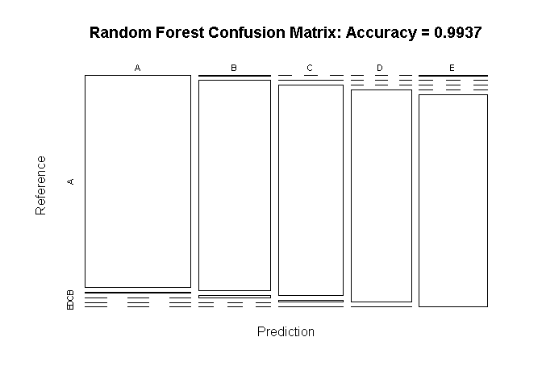
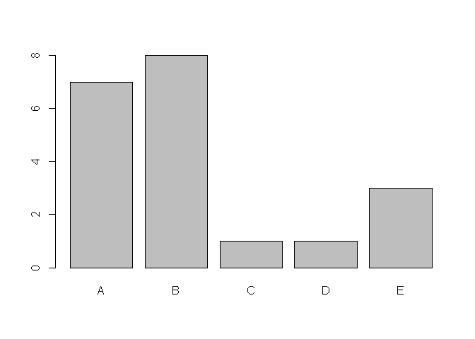

# Quantify Exercise Activity: Correctly vs. Incorrectly
Tejash Panchal  
December 21, 2015  
## Overview:

With availability of mobile devices such as Jawbone Up, Nike FuelBand, and Fitbit, collecting a large amount of personal activity data is possible as well as relatively inexpensive.  Using these types of movement devices, a group of enthusuasts who takes measurements about themselves regularly to improve their health and to find pattern in their behavior.  People regularly quantify how much of a perticularly activity they do, but they rarely quantify how well they do it.  The goal of this project is to predict the manner in which they did the exercise. The "classe" variable in the training set will be used to predict with.

## Getting, loading, and preprocessing the data:
In this section of analysis, I will download the training and testing file from source,  perform initial processing, extract column names from both sets of data, and find differences.


```r
# raw file name assign
raw_training_file <- "pml-training.csv"
raw_testing_file <- "pml-testing.csv"

# Download training file if it doesn't exist
if (!file.exists(raw_training_file)){
        # Download training file
        download.file(url="d396qusza40orc.cloudfront.net/predmachlearn/pml-training.csv",
              destfile=raw_training_file, method="curl")
}

# Download testing file if it doesn't exist
if (!file.exists(raw_testing_file)){
        # Download testing file
        download.file(url="d396qusza40orc.cloudfront.net/predmachlearn/pml-testing.csv",
              destfile=raw_testing_file, method="curl")
}

training <- read.csv(raw_training_file, sep = ",", na.strings = c('NA','#DIV/0!',''))
print(dim(training))
```

```
## [1] 19622   160
```

```r
train_colnames <- colnames(training)

testing <- read.csv(raw_testing_file, sep = ",", na.strings = c('NA','#DIV/0!',''))
print(dim(testing))
```

```
## [1]  20 160
```

```r
test_colnames <- colnames(testing)

# Validate if training and test data are identical.
if ((length(train_colnames) - length(test_colnames)) == 0){
        print("Same number of columns.")
        # Now let's find if train_colnames are same as test_colnames
        print("Different columns between training and testing data.")
        print(setdiff(train_colnames, test_colnames))
        # Now let's find the otherway if test_colnames are same as train_colnames
        print("Different columns between testing and training data.")
        print(setdiff(test_colnames, train_colnames))
}
```

```
## [1] "Same number of columns."
## [1] "Different columns between training and testing data."
## [1] "classe"
## [1] "Different columns between testing and training data."
## [1] "problem_id"
```

## Extracting the Features:
In this section of data processing, I will remove the data sets that are incomplete and keep only complete data sets for my analysis.  I will also remove first few columns of data which is administrative data and not the features.


```r
# Use only complete columns thus remove any columns with NA in training and testing data set
training <- training[,complete.cases(t(training))]
testing <- testing[,complete.cases(t(testing))]

# Also, first 7 columns are not the feature data set so remove them
training <- training[,8:length(colnames(training))]
testing <- testing[,8:length(colnames(testing))]

print(colnames(training))
```

```
##  [1] "roll_belt"            "pitch_belt"           "yaw_belt"            
##  [4] "total_accel_belt"     "gyros_belt_x"         "gyros_belt_y"        
##  [7] "gyros_belt_z"         "accel_belt_x"         "accel_belt_y"        
## [10] "accel_belt_z"         "magnet_belt_x"        "magnet_belt_y"       
## [13] "magnet_belt_z"        "roll_arm"             "pitch_arm"           
## [16] "yaw_arm"              "total_accel_arm"      "gyros_arm_x"         
## [19] "gyros_arm_y"          "gyros_arm_z"          "accel_arm_x"         
## [22] "accel_arm_y"          "accel_arm_z"          "magnet_arm_x"        
## [25] "magnet_arm_y"         "magnet_arm_z"         "roll_dumbbell"       
## [28] "pitch_dumbbell"       "yaw_dumbbell"         "total_accel_dumbbell"
## [31] "gyros_dumbbell_x"     "gyros_dumbbell_y"     "gyros_dumbbell_z"    
## [34] "accel_dumbbell_x"     "accel_dumbbell_y"     "accel_dumbbell_z"    
## [37] "magnet_dumbbell_x"    "magnet_dumbbell_y"    "magnet_dumbbell_z"   
## [40] "roll_forearm"         "pitch_forearm"        "yaw_forearm"         
## [43] "total_accel_forearm"  "gyros_forearm_x"      "gyros_forearm_y"     
## [46] "gyros_forearm_z"      "accel_forearm_x"      "accel_forearm_y"     
## [49] "accel_forearm_z"      "magnet_forearm_x"     "magnet_forearm_y"    
## [52] "magnet_forearm_z"     "classe"
```

```r
print(colnames(testing))
```

```
##  [1] "roll_belt"            "pitch_belt"           "yaw_belt"            
##  [4] "total_accel_belt"     "gyros_belt_x"         "gyros_belt_y"        
##  [7] "gyros_belt_z"         "accel_belt_x"         "accel_belt_y"        
## [10] "accel_belt_z"         "magnet_belt_x"        "magnet_belt_y"       
## [13] "magnet_belt_z"        "roll_arm"             "pitch_arm"           
## [16] "yaw_arm"              "total_accel_arm"      "gyros_arm_x"         
## [19] "gyros_arm_y"          "gyros_arm_z"          "accel_arm_x"         
## [22] "accel_arm_y"          "accel_arm_z"          "magnet_arm_x"        
## [25] "magnet_arm_y"         "magnet_arm_z"         "roll_dumbbell"       
## [28] "pitch_dumbbell"       "yaw_dumbbell"         "total_accel_dumbbell"
## [31] "gyros_dumbbell_x"     "gyros_dumbbell_y"     "gyros_dumbbell_z"    
## [34] "accel_dumbbell_x"     "accel_dumbbell_y"     "accel_dumbbell_z"    
## [37] "magnet_dumbbell_x"    "magnet_dumbbell_y"    "magnet_dumbbell_z"   
## [40] "roll_forearm"         "pitch_forearm"        "yaw_forearm"         
## [43] "total_accel_forearm"  "gyros_forearm_x"      "gyros_forearm_y"     
## [46] "gyros_forearm_z"      "accel_forearm_x"      "accel_forearm_y"     
## [49] "accel_forearm_z"      "magnet_forearm_x"     "magnet_forearm_y"    
## [52] "magnet_forearm_z"     "problem_id"
```

## Data Partitioning:
Now let's split the training data into two sections to create training model. I will allocate 75% of the data to training the model and evaluate the model with 25% of remaining data.


```r
library(caret)
```

```
## Warning: package 'caret' was built under R version 3.1.3
```

```
## Loading required package: lattice
## Loading required package: ggplot2
```

```
## Warning: package 'ggplot2' was built under R version 3.1.3
```

```r
# set seed
set.seed(32343)

# Create data partition
inTrain <- createDataPartition(y=training$classe, time=1, p=0.75, list=FALSE)
trainData <- training[inTrain,]
validationData <- training[-inTrain,]

print(rbind("original dataset" = dim(training),"training set" = dim(trainData), "validation set" = dim(validationData)))
```

```
##                   [,1] [,2]
## original dataset 19622   53
## training set     14718   53
## validation set    4904   53
```

## Model with Random Forest Algorithm and cross validation:
Now I will apply Random Forest Algorithm to remaining 25% of data from training set to validate my model.  I will create confusion matrix to examine the overall statistics of my model.


```r
library(randomForest)
```

```
## Warning: package 'randomForest' was built under R version 3.1.3
```

```
## randomForest 4.6-12
## Type rfNews() to see new features/changes/bug fixes.
```

```r
modelFit_RF <- randomForest(classe ~ ., data=trainData, method="rf")
print(modelFit_RF)
```

```
## 
## Call:
##  randomForest(formula = classe ~ ., data = trainData, method = "rf") 
##                Type of random forest: classification
##                      Number of trees: 500
## No. of variables tried at each split: 7
## 
##         OOB estimate of  error rate: 0.41%
## Confusion matrix:
##      A    B    C    D    E  class.error
## A 4184    1    0    0    0 0.0002389486
## B   13 2832    3    0    0 0.0056179775
## C    0   11 2552    4    0 0.0058433970
## D    0    0   19 2392    1 0.0082918740
## E    0    0    3    6 2697 0.0033259424
```

```r
# Plot Random Forest Model
plot(modelFit_RF)
```

 

```r
varImpPlot(modelFit_RF)
```

 

```r
pred_RF <- predict(modelFit_RF,newdata=validationData)
# logic value for whether or not the rf algorithm predicted correctly
validationData$predRight <- pred_RF==validationData$classe
# tabulate results
print(table(pred_RF, validationData$classe))
```

```
##        
## pred_RF    A    B    C    D    E
##       A 1393    8    0    0    0
##       B    1  940   11    0    0
##       C    0    1  844    6    2
##       D    0    0    0  798    1
##       E    1    0    0    0  898
```

```r
# Confusion Matrix
cm_RF <- confusionMatrix(pred_RF,validationData$classe)
print(cm_RF)
```

```
## Confusion Matrix and Statistics
## 
##           Reference
## Prediction    A    B    C    D    E
##          A 1393    8    0    0    0
##          B    1  940   11    0    0
##          C    0    1  844    6    2
##          D    0    0    0  798    1
##          E    1    0    0    0  898
## 
## Overall Statistics
##                                          
##                Accuracy : 0.9937         
##                  95% CI : (0.991, 0.9957)
##     No Information Rate : 0.2845         
##     P-Value [Acc > NIR] : < 2.2e-16      
##                                          
##                   Kappa : 0.992          
##  Mcnemar's Test P-Value : NA             
## 
## Statistics by Class:
## 
##                      Class: A Class: B Class: C Class: D Class: E
## Sensitivity            0.9986   0.9905   0.9871   0.9925   0.9967
## Specificity            0.9977   0.9970   0.9978   0.9998   0.9998
## Pos Pred Value         0.9943   0.9874   0.9894   0.9987   0.9989
## Neg Pred Value         0.9994   0.9977   0.9973   0.9985   0.9993
## Prevalence             0.2845   0.1935   0.1743   0.1639   0.1837
## Detection Rate         0.2841   0.1917   0.1721   0.1627   0.1831
## Detection Prevalence   0.2857   0.1941   0.1739   0.1629   0.1833
## Balanced Accuracy      0.9981   0.9937   0.9925   0.9961   0.9982
```

```r
# Plot Confusion Matrix
plot(cm_RF$table, col = cm_RF$byClass, main = paste("Random Forest Confusion Matrix: Accuracy =", round(cm_RF$overall['Accuracy'], 4)))
```

 

In random forest model, there is no need for cross-validation or a seperate test set to get an unbiased estimate of the test set error since it is estimated internally.

## Predict Activity Quality:
Now apply the model to testing data to predict activity quality.


```r
# Now apply the RF model to testing data and evaluate
test_result_RF <- predict(modelFit_RF, testing, type = "class")
# test_result_RF <- predict(modelFit_RF, testing)
print(test_result_RF)
```

```
##  1  2  3  4  5  6  7  8  9 10 11 12 13 14 15 16 17 18 19 20 
##  B  A  B  A  A  E  D  B  A  A  B  C  B  A  E  E  A  B  B  B 
## Levels: A B C D E
```

```r
summary(test_result_RF)
```

```
## A B C D E 
## 7 8 1 1 3
```

```r
plot(test_result_RF)
```

 

## Generate answer files for assignment submission:

```r
pml_write_files = function(x){
  n = length(x)
  for(i in 1:n){
    filename = paste0("problem_id_",i,".txt")
    write.table(x[i],file=filename,quote=FALSE,row.names=FALSE,col.names=FALSE)
  }
}

pml_write_files(test_result_RF)
```

## Conclusion:
Original Data source "http://groupware.les.inf.puc-rio.br/har", states that "Class A corresponds to the specified execution of the exercise, while the other 4 classes correspond to common mistakes."  When I applied the model I created to testing data, it predicted that only **7** out of **20** subjects falls under Class A.  In conclusion, my model predicts that roughly 2/3 of people performs exercise incorrectly.

